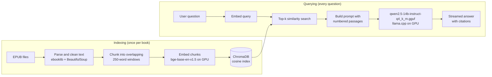

# 📚 Book RAG: Local, GPU-Accelerated Q&A Over Your EPUB Library

A fully offline Retrieval-Augmented Generation (RAG) application that lets you ask natural-language questions about a collection of novels and get **answers grounded in the actual text, with numbered citations**. A quantized 7B LLM, the embedding model and the vector database all run on your own machine. No API keys, no cloud, no data leaving your PC.


---
## Table of contents

1. [The problem](#the-problem)
2. [What this project does](#what-this-project-does)
3. [How it works](#how-it-works)
4. [Tech stack](#tech-stack)
5. [Getting started](#getting-started)
6. [Code walkthrough](#code-walkthrough)
7. [Configuration](#configuration)
8. [Design decisions](#design-decisions)
9. [Troubleshooting](#troubleshooting)
10. [Limitations and roadmap](#limitations-and-roadmap)
11. [Legal note](#legal-note)

---

## The problem

Long, multi-volume book series are hard to search. If you're 10 volumes into a light-novel series and want to know *"What happened during the Sports Festival?"* or *"What was the deal with that character in volume 2?"*, your options are poor:

- **Ctrl+F** only matches exact words, not meaning.
- **Asking a general-purpose chatbot** gives you answers from its training data. It may hallucinate details, mix up volumes, or know nothing about the series at all.
- **Cloud RAG tools** require uploading your books to a third party and usually a paid API.

## What this project does

Book RAG indexes your own EPUB files and answers questions **using only passages retrieved from those books**.

- 🔎 **Semantic search**: finds relevant passages by meaning, not keywords.
- 🧾 **Grounded answers with citations**: the model must cite the passages it used (`[1]`, `[2]`) and say *"I don't know"* when the text doesn't contain the answer.
- 📖 **Per-volume filtering**: restrict a question to one book to avoid spoilers or ambiguity.
- ⚡ **GPU-accelerated**: embeddings (PyTorch/CUDA) and the LLM (llama.cpp, all layers offloaded) both run on the GPU.
- 🔒 **100% local and private**: nothing leaves your machine.
- 🔁 **Incremental indexing**: drop new EPUBs in a folder and only the new ones are embedded.
- 💬 **Streaming web UI**: answers appear token by token, next to a panel showing the retrieved sources and their similarity scores.

---

## How it works



In plain words:

1. **Ingest**: each EPUB is read in spine (reading) order, stripped of HTML and split into overlapping chunks of ~250 words.
2. **Embed**: every chunk is turned into a vector with a sentence-embedding model and stored in ChromaDB alongside metadata (book title, section, chunk number).
3. **Retrieve**: your question is embedded the same way, and the closest chunks are fetched by cosine similarity.
4. **Generate**: the retrieved chunks are pasted into a strict prompt, and a local LLM writes an answer that may only use those passages.

---

## Tech stack

| Layer | Tool | Role |
|---|---|---|
| LLM | [qwen2.5-14b-instruct-q4_k_m.gguf | Answer generation |
| LLM runtime | [llama-cpp-python](https://github.com/abetlen/llama-cpp-python) (CUDA build) | Fast quantized inference on GPU |
| Embeddings | [BAAI/bge-base-en-v1.5](https://huggingface.co/BAAI/bge-base-en-v1.5) via `sentence-transformers` | Semantic vectors (512-token window) |
| Vector DB | [ChromaDB](https://www.trychroma.com/) (persistent, cosine / HNSW) | Storage and similarity search |
| EPUB parsing | `ebooklib` + `BeautifulSoup4` | Text extraction |
| UI | [Gradio](https://www.gradio.app/) | Streaming web interface |
| Language | Python 3.10 | |

**Developed and tested on:** Windows, Python 3.10, NVIDIA RTX 4060 Ti (16 GB VRAM). The quantized model uses roughly 5-6 GB of VRAM.

---

## Getting started

### Prerequisites

- An NVIDIA GPU with a recent driver (CPU works too, but is very slow)
- Python 3.10
- Your own `.epub` files
- A GGUF chat model, e.g. qwen2.5-14b-instruct-q4_k_m.gguf

### 1. Clone the repo

```bash
git clone https://github.com/<your-username>/book-rag-local.git
cd book-rag-local
```

### 2. Install dependencies

Install the **CUDA builds** of PyTorch and llama-cpp-python (adjust `cu124` to match your CUDA version), then the rest:

```bash
# PyTorch with CUDA
pip install torch --index-url https://download.pytorch.org/whl/cu124

# llama-cpp-python with CUDA (prebuilt wheel)
pip install llama-cpp-python --extra-index-url https://abetlen.github.io/llama-cpp-python/whl/cu124

# Everything else
pip install "gradio>=4" chromadb sentence-transformers ebooklib beautifulsoup4
```

> **Windows note:** if `pip` isn't on your PATH, use `py -3.10 -m pip install ...` instead.

### 3. Add your books and model

```
book-rag-local/
├── book_rag_local.py
├── README.md
├── epubs/      ← put your .epub files here
├── models/     ← put ONE .gguf model here
└── chroma_db/  ← created automatically
```

### 4. Run it

```bash
python book_rag_local.py          # Windows launcher: py -3.10 book_rag_local.py
```

The first launch downloads the embedding model, indexes your books, loads the LLM and opens the UI at **http://127.0.0.1:7860**. Subsequent launches skip books that are already indexed. Startup takes a minute or two.

A healthy startup log looks like this:

```
🖥️  Embeddings on GPU: NVIDIA GeForce RTX 4060 Ti
📦 Loading LLM: qwen2.5-14b-instruct-q4_k_m.gguf (llama.cpp GPU offload supported: True)
📚 14 EPUB files found, 14 already indexed, 0 new.
🎉 Launching UI at http://127.0.0.1:7860
```

### Command-line options

| Command | What it does |
|---|---|
| `python book_rag_local.py` | Index only new books, launch the UI |
| `python book_rag_local.py --reindex` | Wipe the index and rebuild it (use after changing chunking or the embedding model) |
| `python book_rag_local.py --llm-verbose` | Show the llama.cpp load log to confirm GPU offload |

---

## Code walkthrough

The whole app lives in a single file, `book_rag_local.py`, organised in numbered sections. Here's what each part does and why.

### Step 1: Make CUDA work on Windows (import order matters)

The CUDA build of `llama-cpp-python` doesn't bundle the CUDA runtime DLLs, but PyTorch does. So the script adds PyTorch's `lib` folder to the DLL search path and imports `torch` **before** `llama_cpp`:

```python
if os.name == "nt":
    _spec = importlib.util.find_spec("torch")
    if _spec and _spec.origin:
        _torch_lib = os.path.join(os.path.dirname(_spec.origin), "lib")
        if os.path.isdir(_torch_lib):
            os.environ["PATH"] = _torch_lib + os.pathsep + os.environ.get("PATH", "")
            os.add_dll_directory(_torch_lib)

import torch  # loads the CUDA runtime DLLs llama.cpp needs
```

Without this, `import llama_cpp` fails with `Failed to load shared library ... llama.dll`.

### Step 2: Read EPUBs in reading order

`read_epub()` walks the book's **spine** (the official reading order), strips scripts and styles, collapses whitespace and returns the title plus a list of plain-text sections. If the spine is missing, it falls back to all document items, and a malformed section is skipped instead of crashing the whole import.

```python
book = epub.read_epub(str(path), options={"ignore_ncx": True})

for idref, _linear in book.spine:
    item = book.get_item_with_id(idref)
    if item is not None and item.get_type() == ebooklib.ITEM_DOCUMENT:
        items.append(item)

soup = BeautifulSoup(item.get_content(), "html.parser")
for tag in soup(["script", "style"]):
    tag.decompose()
text = re.sub(r"\s+", " ", soup.get_text(" ", strip=True)).strip()
```

### Step 3: Chunk the text with overlap

LLMs and embedding models work best on focused passages, not whole chapters. `chunk_sections()` slides a 250-word window across each section with a 40-word overlap, so a sentence cut at a boundary still appears whole in the neighbouring chunk. Chunks never cross section boundaries, and tiny fragments (title pages and so on) are dropped.

```python
step = CHUNK_WORDS - CHUNK_OVERLAP
for sec_idx, text in enumerate(sections):
    words = text.split()
    for start in range(0, len(words), step):
        piece = words[start:start + CHUNK_WORDS]
        if len(piece) < MIN_CHUNK_WORDS:
            break
        chunks.append({"chunk": len(chunks), "section": sec_idx, "text": " ".join(piece)})
        if start + CHUNK_WORDS >= len(words):
            break
```

### Step 4: Embed on the GPU and store in ChromaDB

Chunks are embedded in batches with `bge-base-en-v1.5` (normalised vectors, so cosine similarity is a simple dot product) and upserted into a persistent ChromaDB collection together with metadata. `bge-base` handles 512 tokens, so a 250-word chunk is embedded in full. Smaller models like `all-MiniLM-L6-v2` silently truncate at about 256 tokens.

```python
self.embedder = SentenceTransformer(EMBED_MODEL, device=self.device)

vectors = self.embedder.encode(
    texts, batch_size=64, normalize_embeddings=True, show_progress_bar=progress
)

self.collection.upsert(
    ids=ids, embeddings=embeddings, documents=docs,
    metadatas=[{"book": title, "source": path.stem, "section": c["section"], "chunk": c["chunk"]} ...],
)
```

**Incremental indexing:** on startup the app reads which EPUBs are already in the database and only processes new files:

```python
epubs = sorted(EPUB_DIR.glob("*.epub"), key=lambda p: natural_key(p.stem))
new = [p for p in epubs if p.stem not in self.sources]
```

`natural_key()` makes sorting human-friendly, so *Vol. 2* comes before *Vol. 10* and *Vol. 4.5* lands between 4 and 5.

### Step 5: Retrieve the most relevant passages

The question is embedded (with the BGE query instruction prefix, which improves retrieval quality) and compared against all chunks. An optional metadata filter restricts the search to one book.

```python
kwargs = dict(
    query_embeddings=self.embed([question], is_query=True),
    n_results=top_k,
    include=["documents", "metadatas", "distances"],
)
if book and book != ALL_BOOKS:
    kwargs["where"] = {"book": book}
res = self.collection.query(**kwargs)
```

Cosine distance is converted to a similarity score (`1 - distance`) and shown in the UI, so you can see how confident each match is.

### Step 6: Generate a grounded, cited answer

Retrieved passages are numbered and placed in the prompt. The system prompt forbids outside knowledge and requires citations, which is what keeps hallucinations down:

```python
context = "\n\n".join(f"[{i}] ({h['book']})\n{h['text']}" for i, h in enumerate(hits, 1))
system = (
    "You answer questions about novels using ONLY the numbered passages provided. "
    "Cite the passages you used like [1] or [2]. "
    "If the passages do not contain the answer, say you don't know. "
    "Never use outside knowledge."
)
user = f"Passages:\n\n{context}\n\nQuestion: {question}"
```

The LLM runs with a low temperature (0.2) for factual, consistent answers, with every layer offloaded to the GPU:

```python
self.llm = Llama(model_path=str(model_path), n_ctx=8192, n_gpu_layers=-1)

stream = self.llm.create_chat_completion(
    messages=[{"role": "system", "content": system}, {"role": "user", "content": user}],
    temperature=0.2, max_tokens=600, stream=True,
)
```

### Step 7: Stream everything to the UI

`ask()` is a Python **generator** that yields `(answer_so_far, sources)` on every token, and Gradio re-renders the answer box and the sources panel live. The UI offers a question box, a book filter dropdown and a "passages to retrieve" slider (1-10).

```python
def on_ask(q, b, k):
    if not q or not q.strip():
        yield "Please enter a question.", []
        return
    yield from rag.ask(q.strip(), int(k), b)

ask_btn.click(on_ask, inputs=[question, book, top_k], outputs=[answer, sources])
```

---

## Configuration

All settings are constants at the top of `book_rag_local.py`:

| Setting | Default | Meaning |
|---|---|---|
| `EMBED_MODEL` | `BAAI/bge-base-en-v1.5` | Sentence-embedding model |
| `QUERY_PREFIX` | BGE instruction string | Prepended to queries only (set to `""` for models that don't use one) |
| `CHUNK_WORDS` | `250` | Words per chunk |
| `CHUNK_OVERLAP` | `40` | Words shared between neighbouring chunks |
| `MIN_CHUNK_WORDS` | `30` | Fragments shorter than this are skipped |
| `N_CTX` | `8192` | LLM context window (fits about 10 chunks plus the answer) |
| `MAX_ANSWER_TOKENS` | `600` | Maximum answer length |
| `TEMPERATURE` | `0.2` | Lower is more factual and deterministic |
| `DEFAULT_TOP_K` | `6` | Passages retrieved per question |

> After changing `EMBED_MODEL` or any chunking setting, run with `--reindex`, because old vectors no longer match.

**Using a lighter embedding model:** set `EMBED_MODEL = "all-MiniLM-L6-v2"` and `QUERY_PREFIX = ""`, then `--reindex`.

**Switching the LLM:** put a different `.gguf` file in `models/` (keep only one there).

---
## Agentic Reasoning Mode

Beyond simple retrieval, this system includes an agentic reasoning layer where the LLM actively plans and executes a multi-step search strategy before generating answers.

** How It Works**
User Question
    ↓
[LLM Planning] → "I need to search for X, then Y, then compare"
    ↓
[Tool Execution] → Search passages for X, fetch character info for Y, compare results
    ↓
[Context Synthesis] → Combine all passages and generate grounded answer
    ↓
Answer with Citations
Features
Adaptive Planning: LLM decides what to search for, not fixed retrieval
Multi-step Reasoning: Up to 3 tool calls per question (search, character lookup, cross-volume comparison)
Self-Correction: Explicit reasoning trace shows LLM's decision-making
Debug Mode: See exactly which tools were called and in what order
Usage
bash
# Standard mode (fast, retrieval-based)
python book_rag_local_v2.py

# Agentic mode (slower, reasoning-based)
python book_rag_agentic.py

In the UI, toggle between Standard and Agentic modes. Agentic mode:

Takes 8-15 seconds per query (multi-step reasoning)
Produces deeper, more contextual answers


## Design decisions

- **Local-first.** Privacy, zero running cost and no rate limits. Quantization (Q4_K_M) lets a 7B model fit comfortably in consumer VRAM.
- **Embedding model chosen to match the chunk size.** A 512-token model means no silent truncation of 250-word chunks.
- **Spine-ordered, section-aware chunking.** Chunks respect the book's structure instead of blindly splitting a flat string.
- **Strict grounding prompt.** The model is told to answer only from the numbered passages and to admit when it doesn't know. This trades some fluency for trustworthiness.
- **Transparent retrieval.** Sources, section and chunk numbers and similarity scores are shown next to every answer, so you can verify the response yourself.
- **Idempotent indexing.** Re-running never duplicates data (stable IDs like `<file>::<chunk>` plus `upsert`, and already-indexed books are skipped).
- **Single-file, minimal dependencies.** Easy to read, run and modify.

---

## Troubleshooting

| Problem | Fix |
|---|---|
| `Failed to load shared library ... llama.dll` | The CUDA runtime DLLs weren't found. Keep the DLL-setup block (and `import torch`) above all other imports. |
| Log says CUDA unavailable / GPU offload `False` | Verify: `python -c "import torch, llama_cpp; print(torch.cuda.is_available(), llama_cpp.llama_supports_gpu_offload())"`. Both should print `True`. Reinstall the CUDA builds if not. |
| `TypeError: unhashable type: 'dict'` when the UI opens | Gradio is too old: `pip install --upgrade gradio`. |
| `No GGUF model found` | Put a `.gguf` file in `models/`. |
| Port 7860 already in use | An old instance is still running. Close it and relaunch. |
| Out of GPU memory | Close other GPU-heavy programs or lower `N_CTX` to `4096`. |
| Answers say "I don't know" too often | Raise **Passages to retrieve** (8-10) or filter to the specific volume. |
| Embedding model download fails | Retry with a working connection, or switch to `all-MiniLM-L6-v2` (see [Configuration](#configuration)) and `--reindex`. |

---

## Limitations and roadmap

**Current limitations**


- Each question is answered independently. There is no chat memory or follow-up context.
- Questions that need information from many places at once (for example "summarise the whole series") are limited by `top_k` and the context window.
- Answer quality depends on the LLM, so a 7B model can still misread a passage or cite imperfectly.
- There is no automated evaluation yet.

**Ideas for improvement**

- [ ] Hybrid search (BM25 plus vectors) and a cross-encoder re-ranker
- [ ] Conversational memory and query rewriting for follow-up questions
- [ ] A retrieval and answer-quality evaluation set (hit rate, faithfulness, citation accuracy)
- [ ] Show surrounding text for each source in the UI
- [ ] `requirements.txt` and Docker support
- [ ] Support for PDF and TXT inputs

---

## Legal note

This repository contains **only code**. EPUB files and model weights are not included, and you must supply your own, legally obtained copies. Model weights are subject to their own licenses (see the Qwen2.5 and BGE model pages).

## Author

**Eriks Uzans**, QA Engineer focused on data quality and safety testing for AI/LLM systems.
[LinkedIn](https://www.linkedin.com/in/<your-profile>) · [GitHub](https://github.com/<your-username>)

---

*If you find this useful, a ⭐ is appreciated.*
